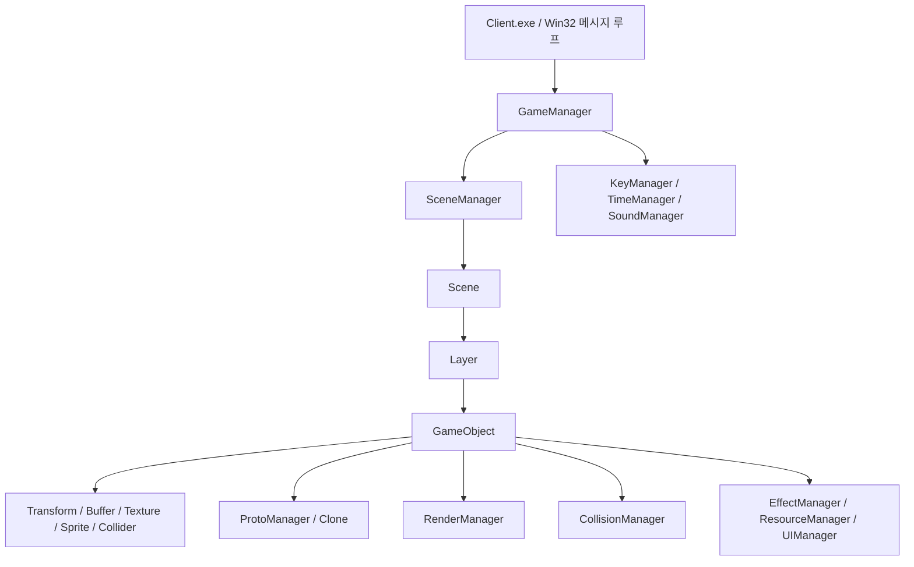
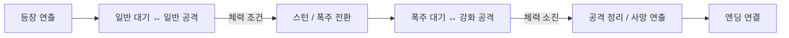

# IRA 모작 — DirectX 9 팀 프로젝트

**공통 프레임워크, 최종보스 도철, 일부 UI를 담당한 C++ 게임 개발 프로젝트입니다.**

Steam 게임 [IRA(이라)](https://store.steampowered.com/app/1536210/?l=koreana)를 참고해, DirectX 9 기반으로 쿼터뷰 탄막 액션 게임을 제작했습니다. 플레이어의 이동·공격·회피, 몬스터와 보스전, 아이템·인벤토리·상점, 미니게임을 팀 단위로 구현했습니다.

저는 **프레임워크 구성·확장, 최종보스 도철의 패턴과 연출, 메인 UI 및 상호작용 UI**를 맡았습니다. 각 기능을 연결하는 과정에서 팀 코드 통합과 플레이어·카메라·미니게임 연동 수정에도 참여했습니다.

`C++` · `DirectX 9` · `D3DX9` · `DirectInput 8` · `FMOD` · `Dear ImGui`

[프로젝트 저장소](https://github.com/Lung-Ji/Software-Rendering-Project) · [GitHub 프로필](https://github.com/Lung-Ji) · [원작 Steam 페이지](https://store.steampowered.com/app/1536210/?l=koreana)

## 프로젝트 개요

| 항목 | 내용 |
|---|---|
| 개발 기간 | 2026.01.30 ~ 2026.03.08 |
| 개발 형태 | 팀 프로젝트 |
| 플랫폼 | Windows PC / x64 |
| 게임 형태 | 쿼터뷰 탄막 액션, 2D 스프라이트 기반 표현 |
| 원작 | IRA — ABShot 개발, Nicalis, Inc. 배급 |
| 주요 담당 | 프레임워크, 최종보스 도철(Docheol), 일부 UI |
| 추가 기여 | 팀 코드 통합, 카메라·플레이어·미니게임 연동 및 동작 수정 |
| 프로젝트 구성 | `Engine.dll` + `Client.exe` |

원작 IRA는 동양 판타지 배경의 2D 쿼터뷰 탄막 슈팅 로그라이트 게임입니다. 이 프로젝트에서는 원작의 전투와 화면 표현을 참고해 스프라이트 애니메이션, 보스 패턴, 이펙트, UI가 이어지는 게임 플레이를 구현했습니다. [원작 소개](https://store.steampowered.com/app/1536210/?l=koreana)

## 기술 스택

| 분류 | 기술 | 활용 |
|---|---|---|
| 언어 | C++ / STL | 객체·컴포넌트, 상태 머신, 매니저, 게임 로직 구현 |
| 언어 표준 | C++17 — Client x64 설정 | 클라이언트 프로젝트의 컴파일 표준 |
| 그래픽 API | DirectX 9 / Direct3D9 | 장치 생성, 정점·인덱스 버퍼, 텍스처, 깊이·알파 렌더 상태 |
| 그래픽 유틸리티 | D3DX9 | 벡터·행렬 연산, 텍스처 로딩, 스프라이트와 폰트 출력 |
| 입력 | DirectInput 8 | 키보드·마우스 상태 조회와 입력 처리 |
| 오디오 | FMOD | BGM·효과음 재생, 채널 그룹, 음량 조절 |
| 개발 도구 UI | Dear ImGui | 디버그 UI 및 팀 공용 타일 편집 기능 |
| 운영체제 API | Win32 API | 윈도우·메시지 루프, 타이머, 파일 입출력 |
| 개발 환경 | Visual Studio 2022 / v143 / Windows SDK | DLL·실행 파일 빌드와 디버깅 |
| 협업 | Git / GitHub | 개인 브랜치 작업, PR·병합, 통합본 관리 |

월드 객체는 Direct3D9의 World·View·Projection 변환과 텍스처를 사용하고, 화면 UI는 D3DX 스프라이트·폰트로 출력합니다. 쿼터뷰 화면에서 2D 이미지와 3D 좌표·깊이 처리를 함께 사용한 구조입니다.

## 담당 업무

| 영역 | 직접 담당한 내용 | 기여 범위 |
|---|---|---|
| **프레임워크** | Scene·Layer·GameObject·Component 공통 구조의 구성·확장, 리소스·이펙트·UI 관리, 충돌 처리와 렌더 흐름 연동 | 팀 공통 기반 담당 |
| **최종보스 도철** | 일반·폭주 페이즈, 공격 상태 전이, 탄막·지면 폭발·메테오·서포터 패턴 | 보스 로직·패턴 구현 |
| **보스 연출** | 등장·사망 시퀀스, 프레임별 이펙트·사운드, 카메라 이동·셰이킹, 체력바·타이틀 연동 | 보스전 연출 구현 |
| **UI** | 메인 UI, 인트로·페이드, NPC 대화, 상호작용 안내, 아이템 획득 팝업 | UI 일부 구현 |
| **인벤토리** | 보관·장착 슬롯 선택, 아이템 교환·삭제, 정보 표시 및 플레이어 데이터 연동 | 기존 UI 위에 팀원과 공동 구현 |
| **통합·연동** | 팀 브랜치 병합, 빌드·리소스 경로 정리, 플레이어와 미니게임의 상태·이펙트 연동 수정 | 프로젝트 전반의 통합 작업 |

프레임워크와 공용 파일에는 팀원들의 확장·수정이 함께 들어 있습니다. 플레이어 본체, 일반 몬스터, 천록 보스, 타일·맵, 미니게임은 팀 구현 영역이며, 해당 코드에는 제가 필요한 연결과 동작 수정을 추가했습니다.

도철의 현재 보스 구현은 **`FinalBoss` 클래스**를 중심으로 구성되어 있습니다. 게임 오브젝트 태그는 `Docheol`을 사용합니다.

## 프레임워크 구조

게임 실행을 담당하는 `Client`와 공통 기능을 제공하는 `Engine`을 분리했습니다. `Base`는 참조 카운트 규약을 제공하고, `Reference`는 클라이언트에서 사용하는 엔진 헤더·라이브러리의 전달 경로입니다.



| 구조·패턴 | 적용 방식 |
|---|---|
| 컴포넌트 기반 객체 | `GameObject`가 Transform·Buffer·Texture·Collider 등의 기능을 조합 |
| Prototype / Clone | 공통 컴포넌트를 등록하고 객체가 필요한 타입을 복제해 사용 |
| Scene / Layer | 씬 안의 객체를 레이어별로 보관하고 Update·LateUpdate 순회 |
| 상태 머신 | 보스의 상태 진입·갱신·종료 동작을 상태 객체로 분리 |
| Singleton 매니저 | 입력·시간·렌더·리소스 등 공용 기능의 접근 지점 제공 |
| 참조 카운트 규약 | `Base::AddRef / Release`, `Safe_Release`로 객체 참조와 해제 시점 관리 |

### 프레임 처리 흐름

```text
Win32 메시지 처리 / TimeManager
  → GUI 프레임 시작
  → SoundManager / KeyManager 갱신
  → SceneManager
      → EffectManager 갱신
      → Scene → Layer → GameObject → Component 갱신
  → LateUpdate
      → 객체 후처리 / 씬별 충돌 검사
  → RenderManager
      → 타일 → 우선 객체 → 불투명 → 알파 → UI
      → 그룹별 이펙트 / 전역 연출
  → ImGui 렌더링
  → Present
```

관련 코드: [GameManager](Client/Code/GameManager.cpp), [GameObject](Engine/Code/GameObject.cpp), [Scene](Engine/Code/Scene.cpp), [Layer](Engine/Code/Layer.cpp), [ProtoManager](Engine/Code/ProtoManager.cpp)

## 핵심 기술

### 01. 공용 리소스·컴포넌트와 렌더 그룹

객체별 게임 로직은 Client에 두고, 공통 컴포넌트·리소스 접근과 렌더링 순서는 Engine을 통해 처리했습니다.

- `ProtoManager`에 컴포넌트 원형을 등록하고 `Clone_Prototype`으로 필요한 기능을 구성합니다.
- `ResourceManager`가 폴더를 순회하며 텍스처를 로드하고, 파일 이름으로 조회하는 공용 경로를 제공합니다.
- 객체는 `RenderManager`에 자신의 렌더 그룹을 등록합니다.
- 타일은 Y값, 알파 객체는 카메라와의 거리로 정렬하며, 그룹별 깊이 쓰기·알파 테스트·블렌딩 상태를 적용합니다.
- 렌더 등록 시 참조를 추가하고, 프레임의 렌더 그룹을 비울 때 해제하는 구조를 사용합니다.

이 공용 흐름 위에 보스, 투사체, 이펙트, UI를 연결했습니다.

관련 코드: [ProtoManager](Engine/Code/ProtoManager.cpp), [ResourceManager](Engine/Code/ResourceManager.cpp), [RenderManager](Engine/Code/RenderManager.cpp), [Base](Base/Base.inl)

### 02. AABB 충돌과 객체별 콜백

충돌 영역의 계산과 충돌 이후의 게임 반응을 나눴습니다.

- `Collider` 컴포넌트가 객체의 충돌 크기·오프셋과 최소·최대 좌표를 관리합니다.
- `CollisionManager`가 등록된 객체의 AABB를 검사합니다.
- 객체의 충돌 목록과 비교해 `OnCollisionEnter / Stay / Exit`를 호출합니다.
- 플레이어 피격, 아이템 상호작용, 보스 공격 이펙트는 각 객체의 콜백에서 처리합니다.
- 보스 이펙트는 종류에 따라 충돌 크기를 다르게 설정하고, 애니메이션 종료 구간에서 충돌 등록을 해제합니다.

예를 들어 지면 폭발은 보이는 이펙트에 Collider를 연결하고, 플레이어와의 충돌을 UI 체력 변화와 연동했습니다. 충돌 매니저가 검사 흐름을 맡고 객체가 자신의 반응을 구현하는 방식입니다.

관련 코드: [Collider](Engine/Code/Collider.cpp), [CollisionManager](Engine/Code/CollisionManager.cpp), [BossEffect](Client/Code/BossEffect.cpp)

### 03. 도철의 페이즈 전환과 공격 상태 머신

도철은 일반 페이즈와 폭주 페이즈에 따라 공격 패턴과 애니메이션을 전환합니다.

`FinalBoss`가 체력·타이머·행동 가능 상태를 확인해 다음 행동을 선택하고, `StateMachine`이 상태의 진입·갱신·종료 함수를 호출합니다. 상태 전환 시 애니메이션 목록과 재생 프레임을 함께 변경합니다.

| 구간 | 구현 내용 |
|---|---|
| 등장 | 플레이어 조작 정지, 보스 타이틀·카메라 이동, 등장 이펙트 |
| 일반 페이즈 | 오른손·전체 휘두르기, 지면 폭발, 메테오 공격 |
| 페이즈 전환 | 체력 조건에 따른 스턴·폭주 연출과 공격 상태 변경 |
| 폭주 페이즈 | 강화된 탄막·지면 공격, 연속 폭발, 서포터 패턴 |
| 사망 | 진행 중인 공격 정리, 카메라·UI 전환, 사망 연출과 엔딩 연결 |



일반 페이즈는 네 가지 공격을 선택하고, 폭주 페이즈는 난수 범위와 패턴 진행 조건을 함께 사용합니다. 보스 전체 흐름을 관리하는 코드와 각 상태의 연출 코드를 나눠 구성했습니다.

관련 코드: [FinalBoss](Client/Code/FinalBoss.cpp), [StateMachine](Client/Code/StateMachine.cpp), [State 인터페이스](Client/Header/StateMachine.h)

### 04. 애니메이션 프레임·타이머 기반 전투 연출

스프라이트 애니메이션의 특정 장면에 투사체·이펙트·사운드를 맞추기 위해 **현재 프레임과 이전 프레임**, **패턴별 타이머와 실행 플래그**를 함께 사용했습니다.

- 프레임이 지정된 인덱스로 바뀌는 시점에 타이틀, 효과음, 공격 생성 요청을 처리합니다.
- 경고 영역 → 메테오 생성 → 폭발처럼 시간차가 필요한 동작은 패턴 타이머로 나눕니다.
- 단계별 플래그를 전환해 같은 타이머 조건에서 동작이 반복 실행되지 않도록 구성합니다.
- 탄막과 서포터는 패턴 단계에서 객체를 준비하고, 시간차를 두어 씬에 등록합니다.
- 등장·사망 시퀀스에서는 플레이어 조작, 카메라, 체력바, 화면 페이드를 함께 조율합니다.

보스의 공격을 애니메이션·판정·시각 효과·음향이 이어지는 하나의 흐름으로 구성한 부분입니다.

관련 코드: [FinalBoss](Client/Code/FinalBoss.cpp), [StateMachine](Client/Code/StateMachine.cpp), [BossFireBall](Client/Code/BossFireBall.cpp), [Supporter](Client/Code/Supporter.cpp), [Camera](Client/Code/Camera.cpp)

### 05. 스프라이트 이펙트와 앞·뒤 렌더 순서

보스의 몸체, 바닥 경고, 화염, 전면 폭발이 겹치는 장면을 표현하기 위해 이펙트를 용도와 출력 위치에 따라 나눴습니다.

- `EffectManager`에서 플레이어·몬스터·보스 전면·보스 후면·UI·전역 이펙트를 관리합니다.
- 보스 후면 이펙트는 알파 객체보다 먼저, 전면 이펙트는 알파 객체 이후에 출력합니다.
- `BossEffect`는 이름과 번호로 구성된 텍스처 시퀀스를 모아 재생합니다.
- 재생 시간과 반복 여부에 따라 프레임을 진행하고, 종료된 이펙트는 갱신 과정에서 정리합니다.
- `UIEffect`는 화면 좌표의 스프라이트 애니메이션으로 UI 반응과 연출을 표현합니다.

같은 보스 패턴 안에서도 배경에 깔리는 효과와 캐릭터 앞을 덮는 효과를 구분해 배치할 수 있도록 했습니다.

관련 코드: [EffectManager](Engine/Code/EffectManager.cpp), [RenderManager](Engine/Code/RenderManager.cpp), [BossEffect](Client/Code/BossEffect.cpp), [UIEffect](Client/Code/UIEffect.cpp)

### 06. UI와 실제 게임 상태의 연결

메인 UI와 대화·인벤토리는 게임 상태를 표시하고, 입력 결과를 다시 게임 객체에 전달하도록 구현했습니다.

| 기능 | 구현 방식 |
|---|---|
| 메인 UI | 플레이어 체력·재화·스킬 등의 상태를 스프라이트와 텍스트로 표시 |
| 보스 UI | 체력과 타이틀을 동기화하고 등장·사망 흐름에 맞춰 표시·페이드 변경 |
| NPC 대화 | 대화 진행, 캐릭터별 이미지·애니메이션, 입력 가이드·화면 연출 |
| 아이템 안내 | 상호작용 가능 상태와 획득·구매한 아이템의 정보를 팝업으로 표시 |
| 인벤토리 | 보관·장착 슬롯 선택과 교환·삭제 결과를 플레이어 데이터에 반영 |
| 인트로·화면 전환 | 시간에 따른 불투명도 변화와 게임 진행 상태 연결 |

`UIManager`는 폰트·전역 UI의 등록과 조회를, `SpriteObject`는 이미지의 위치·크기·가시성·불투명도 처리를 제공합니다. 인벤토리는 팀원의 초기 UI를 기반으로 기능을 확장한 공동 작업입니다.

관련 코드: [MainUI](Client/Code/MainUI.cpp), [NPCTalk](Client/Code/NPCTalk.cpp), [PlayerInven](Client/Code/PlayerInven.cpp), [IntroUI](Client/Code/IntroUI.cpp), [UIManager](Engine/Code/UIManager.cpp), [Sprite](Engine/Code/Sprite.cpp)

## 협업과 추가 기여

개인 기능 구현과 함께 여러 파트가 통합본에서 동작하도록 연결하는 작업을 수행했습니다.

| 작업 | 확인 가능한 예 |
|---|---|
| 팀 코드 통합 | 개인 브랜치와 공용 브랜치 병합, 통합 오류 수정 |
| 빌드·리소스 관리 | 프로젝트 설정, 엔진 산출물 전달, 텍스처 경로·폴더 정리 |
| 플레이어 연동 | 시작 착지 상태와 정지 중 렌더 등록 순서 조정 |
| 미니게임 연동 | 미니게임에서의 대시 이펙트 크기·위치 보정 |
| 타 파트 수정 | 박쥐 업데이트 흐름·추적 방향 계산, 아이템 상호작용 안내 연결 |

작업 이력 예시:

- [도철 1페이즈 완료](https://github.com/Lung-Ji/Software-Rendering-Project/commit/482ec3e)
- [2페이즈 서포터 패턴](https://github.com/Lung-Ji/Software-Rendering-Project/commit/b325540)
- [인트로·아웃트로와 사운드 연동](https://github.com/Lung-Ji/Software-Rendering-Project/commit/cbe880e)
- [NPC 튜토리얼·카메라·플레이어 연동](https://github.com/Lung-Ji/Software-Rendering-Project/commit/5c45c43)
- [최종 통합 및 미니게임 이펙트 보정](https://github.com/Lung-Ji/Software-Rendering-Project/commit/b74d7b2)

Git 기록에는 `Lung-Ji`와 `Yun` 이름을 함께 사용했습니다. 병합 기록에는 팀원의 구현이 포함되므로, 이 README의 개인 담당 범위는 실제 구현·수정 내용에 맞춰 정리했습니다.

## 프로젝트 구조

```text
Software-Rendering-Project/
├─ Base/                         참조 카운트 기반 공통 클래스
├─ Engine/
│  ├─ Code/                      공용 시스템 구현
│  ├─ Header/                    엔진 인터페이스
│  └─ Include/Engine.vcxproj      엔진 DLL 프로젝트
├─ Client/
│  ├─ Code/                      게임 로직·보스·UI·편집 기능
│  ├─ Header/                    게임 클래스 선언
│  └─ Include/Client.vcxproj      실행 파일 프로젝트
├─ Reference/                    엔진 헤더·라이브러리 전달 경로
├─ Resource/                     플레이어·몬스터·무기·이펙트 리소스
├─ Boss/                         보스 리소스
├─ Tile/                         타일·맵 리소스
├─ UI/                           UI 리소스
├─ MonsterManager/               몬스터 관련 리소스
├─ Sound/                        음원과 FMOD
├─ Font/                         폰트 리소스
├─ Data/                         타일·맵 바이너리 데이터
├─ Copy.bat                      엔진 헤더·DLL·LIB 복사
└─ Software Rendering Project.sln
```

팀 공용 타일 편집 기능은 Client 내부에 포함되어 있으며, 저장한 `.dat` 맵 데이터를 게임에서 읽습니다.

## 빌드 및 실행

### 요구 환경

- Windows x64
- Visual Studio 2022 및 C++ 데스크톱 개발 도구
- MSVC v143 / Windows SDK
- Microsoft DirectX SDK (June 2010)
- SDK 설치 경로를 가리키는 `DXSDK_DIR` 환경 변수
- 저장소의 FMOD 라이브러리와 게임 리소스

### 빌드 순서

1. [Software Rendering Project.sln](Software%20Rendering%20Project.sln)을 엽니다.
2. 구성을 **Debug / x64**로 선택하고 시작 프로젝트를 **Client**로 설정합니다.
3. 솔루션을 빌드합니다. Engine → Client 순서의 의존성이 설정되어 있습니다.
4. Engine의 Debug x64 빌드 후 `Copy.bat`이 헤더·DLL·LIB를 복사합니다.
5. `Sound/FMOD/Library/fmod.dll`을 `Client/Bin/`에 배치합니다.
6. Client의 디버깅 작업 디렉터리를 `$(ProjectDir)..\Bin`으로 설정한 뒤 실행합니다.

Visual Studio 개발자 PowerShell에서 저장소 루트를 기준으로 실행하는 예입니다.

```powershell
msbuild ".\Software Rendering Project.sln" /m /p:Configuration=Debug /p:Platform=x64
Copy-Item ".\Sound\FMOD\Library\fmod.dll" ".\Client\Bin\fmod.dll"
Set-Location ".\Client\Bin"
.\Client.exe
```

리소스 경로는 `../../Resource`, `../../Sound`, `../../Data` 등의 상대 경로를 사용하므로 **실행 작업 디렉터리를 Client/Bin으로 맞춰야 합니다.**

이 안내는 현재 프로젝트 설정을 기준으로 작성했습니다. Release 구성은 엔진 산출물 복사 설정이 Debug와 다르므로 별도 확인이 필요하며, README 작성 과정에서 빌드·실행을 새로 검증하지는 않았습니다.

## 원작 및 외부 리소스

- 원작: [IRA(이라)](https://store.steampowered.com/app/1536210/?l=koreana) — ABShot / Nicalis, Inc.
- 본 프로젝트는 원작을 참고한 학습·포트폴리오용 모작입니다.
- 원작 관련 이미지·음원과 외부 라이브러리의 권리는 각 권리자에게 있습니다.
- Dear ImGui와 저장소에 포함된 ImGuizmo 계열 소스, FMOD 등 외부 코드는 개인 구현 기여와 구분합니다.
