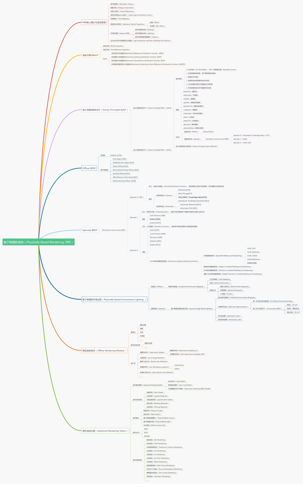
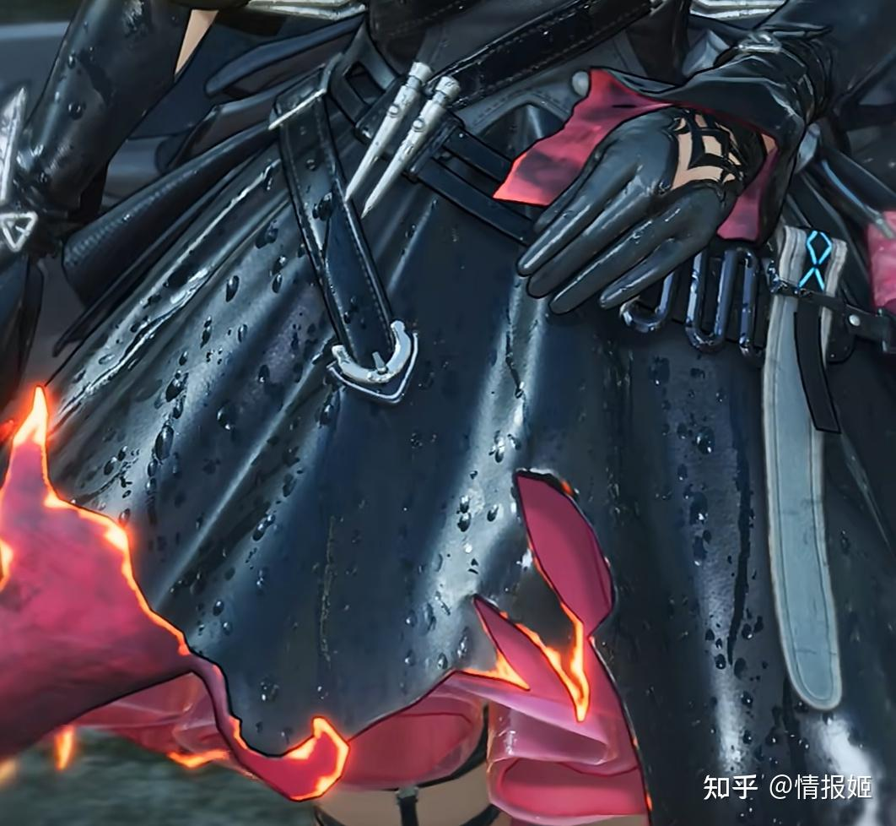

DirectX9에서 DirectX11로 넘어오면서 PBR이라는 개념을 접하게 되었는데, 당시에는 HLSL셰이더 쪽은 지식이 전무했기 때문에, 'PBR이란 실사 렌더링 방식을 상용엔진에서 쓰는구나' 라고 인식하고 넘겼었다.
그러다가 이후에 포폴 만들면서 PBR을 구현해야 됐는데, 뭔지도 모르는 공식들이 너무 많고, 생소한 개념들이 많아 AI에 의존하게 되니까 현타가 와서, 포폴 끝나고서야 정리해본다.

우선, PBR은 매우 방대한 영역의 렌더링 기술이고, 지금까지도 연구가 되고 있다. 

## PBR(Physically Based Rendering)
개념 : PBR은 직역으로는 "물리 기반 렌더링"으로, 현실 세계의 물리 법칙에 근사하여 렌더링하는 기법을 말한다. 주의해야 할 표현이 '근사하여'인데, 현실 물리 법칙을 100%가 아닌, <u>가깝게</u> 표현하는 점이다. 그래서 "물리 **<u>기반</u>** 렌더링"인 것이다. 

그럼 PBR을 쓰면 정확히 뭐가 좋은걸까? 첫 번째로 재질을 정확하게 표현한다는 것이다. 현실에는 정말 다양한 재질이 있는데, 이것을 조명과의 알고리즘을 통해서 사실적으로 표현한다는 것이다. 두 번째로 조명의 환경이 바뀌어도 일관된 재질을 표현한다는 것이다. PBR 표준화 이전 쉐이딩 모델은 광원 환경이 바뀌면 재질 값도 직접 변경해야하는 불편이 있었는데, PBR로 인해 어떤 조명 환경에도 일관된 표현을 하는 점이 큰 이점이 되는 것이다.

우리가 주목할 것은 "현실 세계의 물리 법칙에 근사하여"이다. 컴퓨터 그래픽스에서는 어떻게 현실과 가깝게 렌더링을 한다는 것일까? 이를 위해서 [미세면 모델], [에너지 보존 법칙], [BRDF], [Fresnel]을 알아볼 것이다.

### 미세면 모델(Microfacet Model)

### 에너지 보존 법칙 (Energy Conservation)

### BRDF

### Fresnel
## Luminance & Illuminance
**Illuminance(조도) :** 광원에 의해서 물체가 비춰지는 양(lux) -> 표면이 얼마나 밝게 '비춰지는지'
**Luminance(휘도) :** 눈(또는 카메라)에 들어오는 빛의 양 -> 얼마나 밝게 '보이는지'

※ Radiance(복사 휘도) & Irradiance(복사 조도) 라는 말도 있는데, 이건 Luminance & Illuminance가 사람의 시각을 기준으로 한다면, Radiance & Irradiance는 물리량을 기준으로 한다. 즉, Radiance & Irradiance는 에너지, Luminance & Illuminance는 밝기 라고 보면 되고, Radiance ↔ Luminance, Irradiance ↔ Illuminance 거의 같은 개념이라고 보면 된다.

## PBR & NPR
PBR은 "현실"의 물리 법칙에 근거하여 빛을 표현한다고 언급했다. 그렇기에 왠만한 실사풍 게임은 PBR을 사용한다고 보면 된다. 실사풍이 아닌 게임은 NPR이 적용됐다고 하는데, PBR의 반대 개념으로, Non-PBR(NPR)이라고 부른다. 명조, 원신같은 서브컬쳐풍 게임이나, 옛날 WOW(PBR이 대중화 되기 이전 게임들)같은 게임의 렌더링을 전부 NPR이라고 한다. 여기까지는 '실사풍 = PBR / 그 외 = NPR'로 이해하기 쉬운데, 최근 서브컬쳐풍 게임에 적용되고 있는 렌더링 방식으로 'PBR + NPR', 일명 **'하이브리드 렌더링 방식'** 이 떠오르고 있다. '사실적인 애니메이션'을 고안하여 나온 PBR의 빛 표현을 기본으로 하되, 그 위에 툰 쉐이딩같이 커스터마이징하는(NPR) 독특한 렌더링 방식을 말한다. 개인적으로 최근 게임에서, '명일방주 : 엔드필드'를 봤을 때, PBR에 가까운 느낌을 받았는데, 아래 사진을 보면 알 수 있다.

 
 
 

또 급 부상하고 있는 새로운 렌더링 패러다임으로 NVIDIA에서 **'신경망 렌더링'(Neural Rendering)** 을 소개하고 있다. 이 부분은 꽤 복잡하고 현재 글이랑 너무 떨어지는 주제라서, 나중에 Rendering Tech 카테고리에서 다루겠다.

원문 : 
https://zhuanlan.zhihu.com/p/1999230233572820754