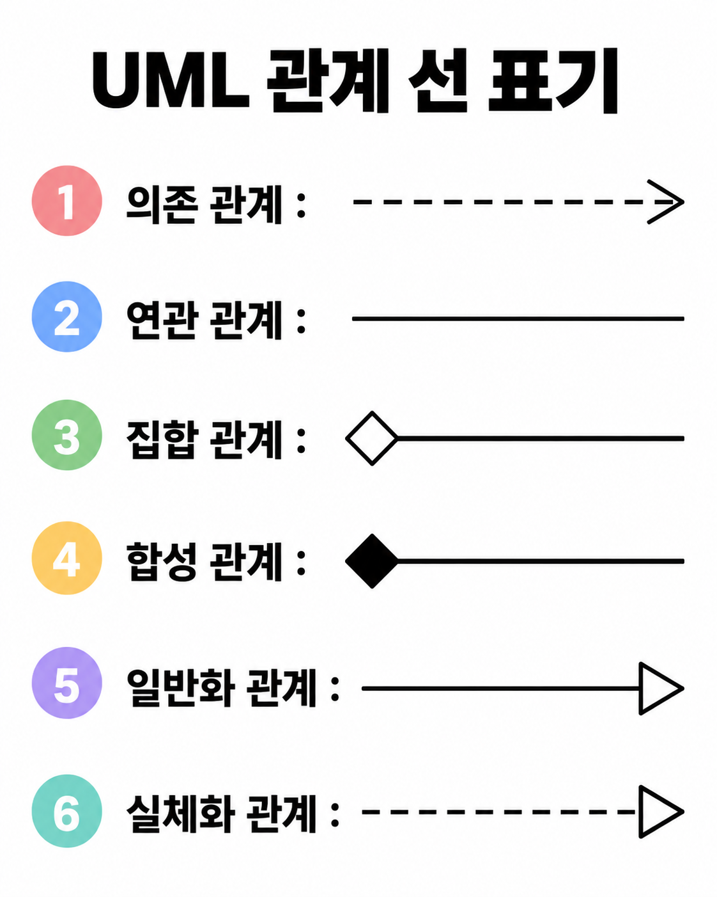
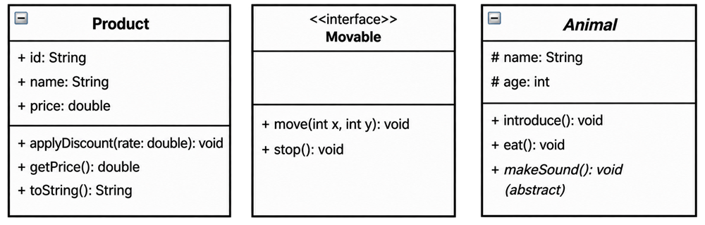
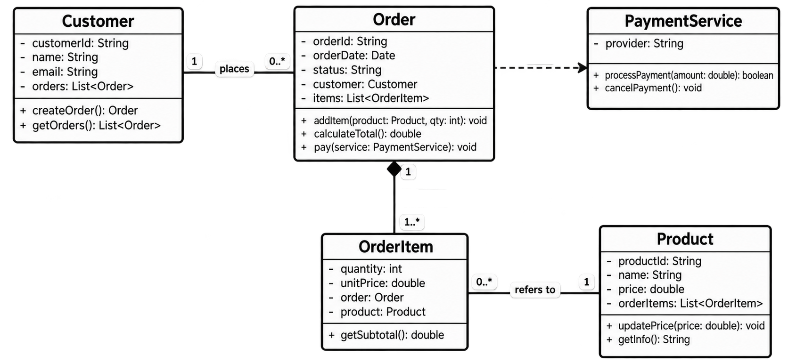
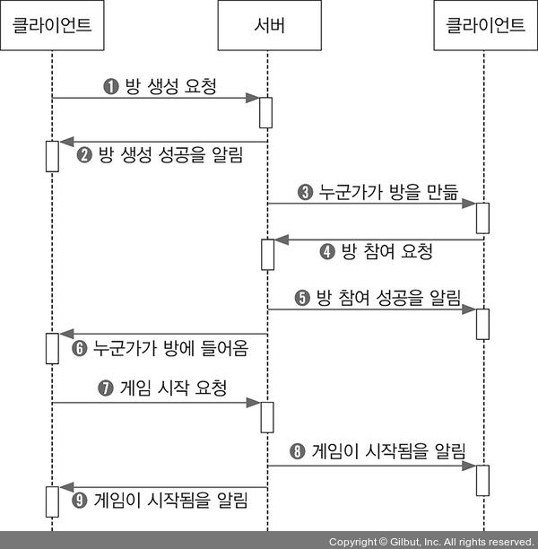

[ Unified Modeling Language ]

UML(Unified Modeling Language)은 SW 개발 과정에서 시스템의 구조와 기능을 시각화/문서화하기 위한 범용 모델링 언어이다. 대규모 프로젝트의 경우, 복잡한 설계들을 개발자와 개발자, 개발자와 클라이언트(기획자, QA, 디자이너)들이 의사소통을 하는 데 있어, 표준화된 방식을 제공한다. 이를 통해서, 프로젝트 진행을 원활하게 만들고, 시각화를 통해서 프로젝트를 빠르게 이해시키는 기능을 가지고 있다. 

---

# Relationships

### <font color="#953734"><font color="#e36c09">의존 관계 (Dependency)</font></font> 
- **<font color="#ffffff">개념 :</font>** A클래스가 B클래스를 일시적으로 참조하는 상태, B클래스의 Method를 일시적으로 사용, 
        B클래스 매개변수, A클래스 함수 내부의 B클래스 지역변수 선언, B클래스 return 타입
- 필요할 때 잠시 사용하는 관계 -> Decoupling에 매우 좋은 관계, 생명주기와 연관 X

``` cpp
class CreditCard {...}
class Receipt {...}
class PaymentService { 
public: 
	// 1. 매개변수로 참조 전달받아 사용
	void ProcessPayment(const CreditCard& card, int amount) const { 
		card.pay(amount); 
	} 
	// 2. 내부 지역 변수로 생성 
	void IssueReceipt() const { 
		Receipt receipt; 
		receipt.print(); 
	} 
	// 3. 리턴 타입으로 반환 
	Receipt CreateReceipt() const { return Receipt(); }
};
```

### <font color="#e36c09">연관 관계 (Association)</font>
- 개념 : A클래스와 B클래스가 서로 연관되어 있는 관계.
	- A클래스의 멤버변수 B클래스 (+ 반대, 양방향)


``` cpp
class Driver {...}
class Car { 
private: 
	Driver* driver;
public: 
	Car(Driver* driver = nullptr) : driver(driver) {}  //생성자로 관계 형성
}
```

### <font color="#e36c09">집합 관계 (Aggregation)</font>
- 개념 : A클래스(전체)가 여러 B클래스(부분) 객체들을 모아서 관리하는 관계.
- 특성 : 전체가 사라져도(해제) 부분은 사라지지 않고 독립적으로 존재함 (결합도가 낮은 관계)
	- A클래스의 멤버변수로 B클래스를 가지지만, 생성자 초기화를 통해 외부에서 생성된 B클래스 객체를 받아와, 멤버변수를 초기화 하는 경우. (A클래스가 해제되어도 B클래스는 영향X)


``` cpp
class Student {...}
class School { 
private: 
	vector<shared_ptr<Student>> students;
public:
	School(vector<shared_ptr<Student>>& studentslist) : students(studentslist) {}  
}
```

### <font color="#e36c09">합성 관계 (Composition)</font>
- 개념 : A클래스(전체)가 여러 B클래스(부분) 객체들을 모아서 관리하는 관계.
- 특성 : 전체와 부분이 강한 결합으로 이뤄짐. 전체가 사라지면 부분도 사라지는 특성(집합 관계와 반대).
	- A클래스의 멤버변수로 B클래스를 가지는데, A의 생명주기에 B의 생명주기가 종속되는 관계. (A클래스가 해제되면 멤버변수 B클래스도 영향(해제).)

``` cpp
class CPU {...}
class Computer { 
private: 
	std::unique_ptr<CPU> cpu;
public: 
	Computer() : cpu(std::make_unique<CPU>()) { } 
	~Computer() { };
}

int main() { 
	Computer* pc = new Computer(); 
	// Computer 객체가 만들어지면서 멤버 변수 cpu도 생성자에 의해 동적할당
	delete pc;
	// Computer 객체가 소멸되면서 멤버 변수 cpu도 소멸자 호출
}
```

### <font color="#e36c09">일반화 관계 (Generalization)</font>
- 개념 : 부모와 자식 관계, 즉 상속 관계(Is-A 관계)를 표현하는 관계이다.

``` cpp
class Animal {
public:
	virtual void Move() {}
	virtual void Sound() = 0;
}
class Gibra : public Animal { ... }   // Gibra is Animal
class Rabbit : public Animal { ... }  // Rabbit is Animal
```

### <font color="#e36c09">실체화 관계 (Realization)</font>
- 개념 : interface 클래스와 interface를 구현하는 클래스와의 관계.
- 특성 : interface 클래스에 정의된 메서드(순수 가상 함수)를 상속받는 클래스가 반드시 interface 클래스의 메서드를 구현해야 한다.
``` cpp
class Attackable {
public:
	virtual void Attack() = 0;
}
class Sword : public Attackable { 
public:
	virtual void Attack() { ... }  // Attackable 메서드 구현
}
class Rifle : public Attackable { 
public:
	virtual void Attack() { ... }  // Attackable 메서드 구현
}
```

- **<집합 관계>와 <연관 관계> 모호성 :** <연관 관계>는 두 클래스가 서로 대등한 관계, <집합 관계>는 두 클래스 중에서 전체와 부분 관계로 나뉜다. ex. Car / Person [연관 관계], Car / Wheel [집합 관계]   하지만, <집합 관계>는 <연관 관계>랑 코드 차이도 없고, 전체랑 부분을 나누는 것도 큰 의미를 가지지 않는 이상, <연관 관계>로 대체가 가능하다. 위에서 Car / Wheel을 집합 관계로 설명했지만, 당연히 연관 관계로 나타낼 수 있고, "Wheel은 반드시 Car의 필수 부품이어야 해."같은 명확한 규칙 없으면 연관 관계로 통일하는게 생각하기 편하다고 한다.

- 관계 표현 방법 : UML에서는 각 관계를 '선'으로 표현하는데 각각 다른 선을 사용한다. 조금 헷갈리지만구분법은 다음과 같다. 또한 방향이 중요한데, 일반화/실체화 경우 { 자식 --> 부모 }, 의존/연관은 { A --> B }, 합성/집합은 { 전체 ◇── 일부 }로 표현할 수 있다.
 
  ※ 출처 - AI 생성형 이미지
---
# Diagram

### 클래스 다이어그램 (Class Diagram)
- 개념 : 클래스의 내부 구성요소들(변수, 함수)과 클래스 간의 관계들을 보여주는 다이어그램.
- 사례 : 아무래도 복잡한 게임 개발에서는 클래스들의 관계 구조화/시각화에 더하여 가시성이 주 목적일 것 같고 , 더 나아가 디자인패턴에서 구조를 나타내는데 잘 쓰인다.

	※ 출처 - AI 생성형 이미지
-  속성 표현 : 맨 왼쪽 Product 노드를 보면, 다음과 같이 나타낼 수 있다.
``` cpp
class Product {
// + : public, - : private, # : protected로 나타낼 수 있다.
// 메서드는 [함수명(매개변수) : 리턴타입] 으로 나타낼 수 있고,
// 변수는 [변수명 : 변수타입] 으로 나타낼 수 있다.
public:
	void applyDiscount(double rate);  
	double getPrice();
	String toString();
	
public:
	String id;  
	String name;
	double price;
}
```
 + 두 번째 노드같이, interface, abstract 클래스는 \<\<interface\>\>, \<\<abstract\>\> 로 클래스명 위에 두어 표시한다. (세 번째 노드는 abstract 클래스의 또 다른 표현방식)
 + 관계 표현 : 위 에서 다뤘던 #Relationships 의 관계 선으로 표현한 클래스 다이어그램을 다음과 같이 예시로 만들어 보았다.
   ※ 출처 - AI 생성형 이미지
 - 해석 : 
	 - Customer - Order 연관 관계 : 1명의 고객이 여러 주문을 넣는 관계 
	   (고객A -> @주문1, @주문2) (고객B -> @주문3)
	 - Order - OrderItem 합성 관계 : 1개의 주문에는 1개 이상의 주문 정보가 존재하여 종속적인 관계 (@주문1 -> {마우스, 2개, $3}, {키보드, 1개, $2}...)
	 - Order - PaymentService 의존 관계 : 일시적으로 PaymentService를 매개변수로 받아 processPayment 메서드를 실행시킨다. (@주문1 -> 카카오페이)
	 - OrderItem - Product 연관 관계 : Product가 하나에는 0개 이상의 OrderItem이 연결되어 있어야 하고, 반복적으로 참조가 가능한 관계. (H마우스를 @주문1 항목, @주문3 항목에서 요구)

### 시퀀스 다이어그램 (Sequence Diagram)
- 개념 : **"시퀀스"** 말 그대로 순서대로 관계를 나타내는 다이어그램. 조금 더 자세하게는 시간이 진행되면서 객체들이 순서대로 상호작용하는 흐름을 표현하는 다이어그램이다.
- 사례 : 서버에 패킷을 주고 받는데 순서가 필요하고, 스레드 프로그래밍에서 임계 영역을 해결하기 위해서 사용된다. 게임 서버를 예시로 시퀀스가 어떻게 진행되는지 나타내는 다이어그램이 
- 
  ※ 출처 - https://thebook.io/006884/0321/
- 관계 표현 : 시퀀스 다이어그램은 위->아래 순으로 진행이 된다. 사진처럼 ① 방 생성 요청 -> ② 방 생성 성공을 알림 -> ③ ... -> ④ ... 순서로 이어지는데, 위에서 아래로 흘러가는 것을 볼 수 있다. 클라나 서버에서 밑으로 점선이 내려오는데, 이 점선을 객체의 Lifeline(생명선), 점선 중간에 직사각형 막대가 있는데, 이 막대가 작업을 처리하고 있는 구간으로 '활성화'되어 있다고 표현한다.
- 메세지 : 객체끼리 상호작용하는 방법은 '메시지'를 사용한다. 위 그림에서 가로 화살표들은 전부 메시지다. '요청', '응답'으로 나눌 수 있는데, 클라이언트가 서버에 보내는 메시지는 '요청', 서버가 클라이언트에 보내는 메시지는 '응답'이다. 그런 메세지도 유형과 '선'표현 법이 있는데 이건 표로 정리했다.

| 동기 메세지  | 요청 메세지를 보낸 다음 응답 메세지가 올 때까지 대기   | 실선 + 채운 화살표 : A ㅡ▶ B   |
| ------- | -------------------------------- | ---------------------- |
| 비동기 메세지 | 요청 메세지만 보내고, 응답 메세지를 대기하지 않음.    | 실선 + 열린 화살표 : A → B    |
| 자체 메세지  | 자기 자신에게 보내는 메시지.                 | 실선 + 채운 화살표 : A ㅡ▶ A   |
| 반환 메세지  | 요청에 대해 메시지를 반환. (동기 메세지의 응답 메세지) | 점선 + 열린 화살표 : B ---> A |
